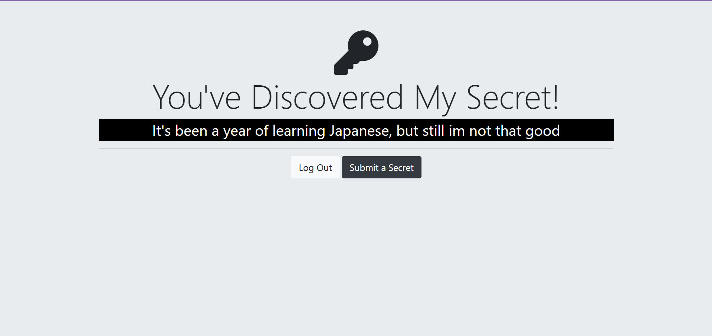

# 🔐 Secrets - Anonymous Secret Sharing App

A secure web application where users can anonymously share their secrets. Built with Node.js, Express, PostgreSQL, and featuring both local and Google OAuth authentication.


## ✨ Features

- **Secure Authentication**: Local registration/login with bcrypt password hashing
- **Google OAuth Integration**: Quick login with Google accounts
- **Anonymous Secret Sharing**: Share secrets without revealing your identity
- **Session Management**: Secure session handling with express-session
- **Responsive Design**: Clean and modern user interface
- **PostgreSQL Database**: Reliable data storage

## 🛠️ Tech Stack

- **Backend**: Node.js, Express.js
- **Database**: PostgreSQL
- **Authentication**: Passport.js (Local & Google OAuth 2.0)
- **Security**: bcrypt for password hashing
- **Session Management**: express-session
- **View Engine**: EJS templating
- **Environment Variables**: dotenv

## 📸 Screenshots

### Homepage


### Login Page


### Registration


### Secrets Feed


### Submit Secret


## 🚀 Getting Started

### Prerequisites

- Node.js (v14 or higher)
- PostgreSQL database
- Google OAuth credentials (for Google login)

### Installation

1. **Clone the repository**
   ```bash
   git clone https://github.com/yourusername/secrets-app.git
   cd secrets-app
   ```

2. **Install dependencies**
   ```bash
   npm install
   ```

3. **Set up PostgreSQL database**
   ```sql
   CREATE DATABASE secrets_db;
   CREATE TABLE users (
     id SERIAL PRIMARY KEY,
     email VARCHAR(255) UNIQUE NOT NULL,
     password VARCHAR(255),
     secret TEXT
   );
   ```

4. **Configure environment variables**
   
   Create a `.env` file in the root directory:
   ```env
   # Database Configuration
   PG_USER=your_postgres_username
   PG_HOST=localhost
   PG_DATABASE=secrets_db
   PG_PASSWORD=your_postgres_password
   PG_PORT=5432

   # Session Secret
   SESSION_SECRET=your_super_secret_session_key

   # Google OAuth Credentials
   GOOGLE_CLIENT_ID=your_google_client_id
   GOOGLE_CLIENT_SECRET=your_google_client_secret
   ```

5. **Start the application**
   ```bash
   npm start
   ```

6. **Access the app**
   
   Open your browser and navigate to `http://localhost:3000`

## 🔧 Configuration

### Google OAuth Setup

1. Go to [Google Cloud Console](https://console.cloud.google.com/)
2. Create a new project or select existing one
3. Enable Google+ API
4. Create OAuth 2.0 credentials
5. Add authorized redirect URI: `http://localhost:3000/auth/google/secrets`
6. Copy Client ID and Client Secret to your `.env` file


### Database Schema

```sql
CREATE TABLE users (
  id SERIAL PRIMARY KEY,
  email VARCHAR(255) UNIQUE NOT NULL,
  password VARCHAR(255),
  secret TEXT
);
```

## 📱 Usage

### Local Authentication
1. **Register**: Create a new account with email and password
2. **Login**: Sign in with your credentials
3. **Submit Secret**: Share your anonymous secret
4. **View Secrets**: Browse all submitted secrets


### Google Authentication
1. Click "Login with Google"
2. Authorize the application
3. Automatically redirected to secrets page
4. Submit and view secrets


## 🔒 Security Features

- **Password Hashing**: All passwords are hashed using bcrypt with 10 salt rounds
- **Session Security**: Secure session management with configurable expiration
- **SQL Injection Protection**: Parameterized queries prevent SQL injection
- **Authentication Middleware**: Protected routes require authentication
- **Environment Variables**: Sensitive data stored in environment variables

## 🌐 API Routes

### Public Routes
- `GET /` - Homepage
- `GET /login` - Login page
- `GET /register` - Registration page
- `POST /login` - Login authentication
- `POST /register` - User registration

### Protected Routes
- `GET /secrets` - View all secrets (requires authentication)
- `GET /submit` - Submit secret form (requires authentication)
- `POST /submit` - Submit secret (requires authentication)
- `GET /logout` - Logout user

### OAuth Routes
- `GET /auth/google` - Initiate Google OAuth
- `GET /auth/google/secrets` - Google OAuth callback

## 📁 Project Structure

```
secrets-app/
├── public/             # Static files (CSS, images, JS)
├── views/              # EJS templates
│   ├── home.ejs
│   ├── login.ejs
│   ├── register.ejs
│   ├── secrets.ejs
│   └── submit.ejs
├── images/             # Screenshots and assets
├── .env                # Environment variables (not in repo)
├── .gitignore
├── package.json
├── README.md
└── index.js            # Main application file
```


## 🚧 Future Enhancements

- [ ] User profiles and avatars
- [ ] Secret categories and tags
- [ ] Like/favorite secrets functionality
- [ ] Email verification for registration
- [ ] Password reset functionality
- [ ] Mobile app version
- [ ] Real-time secret updates
- [ ] Secret expiration dates
- [ ] Comment system for secrets

## 🤝 Contributing

1. Fork the repository
2. Create a feature branch (`git checkout -b feature/amazing-feature`)
3. Commit your changes (`git commit -m 'Add amazing feature'`)
4. Push to the branch (`git push origin feature/amazing-feature`)
5. Open a Pull Request


## 📄 License

This project is licensed under the MIT License - see the [LICENSE](LICENSE) file for details.

## 👨‍💻 Author

**Your Name**
- GitHub: [@Sri-Ranga9989](https://github.com/Sri-Ranga9989)
- LinkedIn: [LinkedIn](https://www.linkedin.com/in/sriranga-p-216a09197/)
- Email: srirangapuram.817@gmial.com

## 🙏 Acknowledgments

- [Passport.js](http://www.passportjs.org/) for authentication strategies
- [Bootstrap](https://getbootstrap.com/) for responsive design components
- [Google OAuth](https://developers.google.com/identity/protocols/oauth2) for social authentication
- [PostgreSQL](https://www.postgresql.org/) for reliable database management


⭐ **Star this repository if you found it helpful!**
